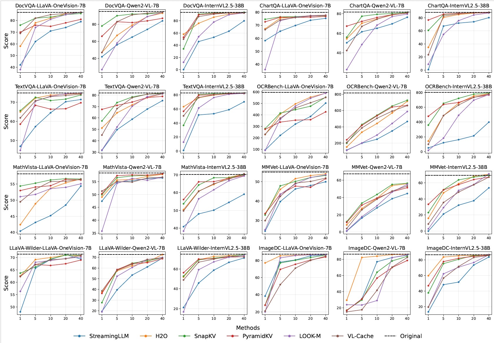

<h1 align="center">

EffiVLM-Bench: A Comprehensive Benchmark for Evaluating Training-Free Acceleration in Large Visual-Languge Models
</h1>


<p align="center">
  📄  <a href=""><strong>Paper</strong></a> |  
  🏠 <a href=""><strong>Project Website</strong></a>
</p>


<p align="center">
    <a href="https://kugwzk.github.io/">Zekun Wang*</a>, 
    <a href="">MingHua Ma*</a>, 
    <a href="">Zexin Wang*</a>, 
    <a href="">Rongchuan Mu*</a>, 
    <a href="">liping shan</a>, 
    <a href="https://scholar.google.com/citations?user=VJtmTREAAAAJ&hl=en">Ming Liu</a>, 
    <a href="https://scholar.google.com/citations?user=LKnCub0AAAAJ">Bing Qin</a>, 

</p>
<p align="center">Harbin Institute of Technology , Du Xiaoman Technology</p>


<!--  -->

# 🔥 Overview 
We introduce EffiVLM-Bench, a comprehensive benchmark designed to systematically evaluate training-free acceleration methods for Large Visual-Language Models (LVLMs). While LVLMs have achieved remarkable performance across diverse multimodal tasks, their high computational and memory demands hinder practical deployment and scalability. Although various acceleration techniques have been proposed, a lack of unified evaluation across different architectures, datasets, and metrics limits our understanding of their effectiveness and trade-offs. 

In this work, we introduce a comprehensive benchmark, EffiVLM-Bench, to investigate the effectiveness of training-free acceleration methods across representative LVLMs and diverse datasets. We concentrate on evaluating various mainstream acceleration methods classified into two categories: token compression and parameter compression. EffiVLM-Bench provides a unified framework for evaluating not only the absolute performance but also the generalization and loyalty capabilities of these methods, while further exploring the Pareto-optimal trade-offs between performance and efficiency.  

  

# 📌 News
- 2025.05.18 EffiVLM-Bench is accepted to **ACL 2025**!


# 🖥️ Installation

## Create a new conda environment and install the basic dependencies
    ```bash
    conda create -n mllm-efficiency python=3.10
    conda activate mllm-efficiency
    pip install -r requirements.txt
    pip install ninja
    pip install omegaconf
    pip install flash-attention-softmax-n
    conda install pytorch==2.3.0 torchvision==0.18.0 torchaudio==2.3.0 pytorch-cuda=12.1 -c pytorch -c nvidia
    conda install nvidia/label/cuda-12.1.1::cuda-nvcc
    ```

## Change the env path 
    ```bash
    mkdir -p $CONDA_PREFIX/etc/conda/activate.d
    mkdir -p $CONDA_PREFIX/etc/conda/deactivate.d
    ```
    Create a new file in the activate.d directory and add the following content:
    ```bash
    #!/bin/bash
    export CUDA_HOME=$(dirname $(dirname $(which nvcc)))
    ``` 
    Create a new file in the deactivate.d directory and add the following content:
    ```bash
    #!/bin/bash
    unset CUDA_HOME
    ```

## Install the flash-attn
    ```bash
    conda activate mllm-efficiency
    echo $CUDA_HOME
    which nvcc
    pip install flash-attn --no-build-isolation
    ```
## use lmms-eval
    ```bash
    cd lmms-eval
    pip install -e .
    cd ../llava/
    pip install -e .
    pip install numpy==2.2.0
    ```
    **MUST use scripts in base folder, or will raise ModuleNotFoundError**

## use qwen2_vl for develop
    ```bash
    cd qwen2vl
    pip install -e .
    ```


# 🚀 Quick Start

## Use lmms-eval to eval on various of benchmarks.

We use lmms-eval to evaluate various benchmarks. For examples of startup scripts, please refer to the run_example.sh file. You only need to replace your own paths and related module names and parameter names accordingly.

```bash
./run_example.sh
```

## Some hyperparams

1. model_args:pretrained,conv_template,model_name,method,...

```python
def __init__(
        self,
        pretrained: str = "/share/home/mhma/models/llava-onevision-qwen2-7b-ov",
        truncation: Optional[bool] = True,
        device: Optional[str] = "cuda:0",
        batch_size: Optional[Union[int, str]] = 1,
        model_name: Optional[str] = 'llava_qwen',
        attn_implementation: Optional[str] = best_fit_attn_implementation,
        device_map: Optional[str] = "cuda:0",
        conv_template: Optional[str] = "qwen_1_5",
        use_cache: Optional[bool] = True,
        truncate_context: Optional[bool] = False,  # whether to truncate the context in generation, set it False for LLaVA-1.6
        customized_config: Optional[str] = None,  # ends in json
        max_frames_num: Optional[int] = 32,
        mm_spatial_pool_stride: Optional[int] = 2,
        mm_spatial_pool_mode: Optional[str] = "bilinear",
        token_strategy: Optional[str] = "single",  # could be "single" or "multiple", "multiple" denotes adding multiple <image> tokens for each frame
        video_decode_backend: str = "decord",
        method: Optional[str] = None, # None is not used kv cache.
        **kwargs,
    )
```

If you are trying to use large LLaVA models such as LLaVA-NeXT-Qwen1.5-72B, you can try adding device_map=auto in model_args and change num_processes to 1.

2. command line use

    This mode supports a number of command-line arguments, the details of which can be also be seen via running with `-h` or `--help`:

    - `--model` : Selects which model type or provider is evaluated. Must be a string corresponding to the name of the model type/provider being used. See [the main README](https://github.com/EleutherAI/lm-evaluation-harness/tree/main#model-apis-and-inference-servers) for a full list of enabled model names and supported libraries or APIs.

    * `--model_args` : Controls parameters passed to the model constructor. Accepts a string containing comma-separated keyword arguments to the model class of the format `"arg1=val1,arg2=val2,..."`, such as, for example `--model_args pretrained=liuhaotian/llava-v1.5-7b,batch_size=1`. For a full list of what keyword arguments, see the initialization of the corresponding model class in `lmms_eval/models/`.

    * `--tasks` : Determines which tasks or task groups are evaluated. Accepts a comma-separated list of task names or task group names. Must be solely comprised of valid tasks/groups. You can use `--tasks list` to see all the available tasks. If you add your own tasks but not shown on the list, you can try to set `--verbosity=DEBUG` to view the error message. You can also use `--tasks list_with_num` to check every tasks and the number of question each task contains. However, `list_with_num` will download all the available datasets and may require lots of memory and time.

    - `--num_fewshot` : Sets the number of few-shot examples to place in context. Must be an integer.

    - `--gen_kwargs` : takes an arg string in same format as `--model_args` and creates a dictionary of keyword arguments. These will be passed to the models for all called `generate_until` (free-form or greedy generation task) tasks, to set options such as the sampling temperature or `top_p` / `top_k`. For a list of what args are supported for each model type, reference the respective library's documentation (for example, the documentation for `transformers.AutoModelForCausalLM.generate()`.) These kwargs will be applied to all `generate_until` tasks called--we do not currently support unique gen_kwargs or batch_size values per task in a single run of the library. To control these on a per-task level, set them in that task's YAML file.

    - `--batch_size` : Sets the batch size used for evaluation. Can be a positive integer or `"auto"` to automatically select the largest batch size that will fit in memory, speeding up evaluation. One can pass `--batch_size auto:N` to re-select the maximum batch size `N` times during evaluation. This can help accelerate evaluation further, since `lm-eval` sorts documents in descending order of context length.

    - `--max_batch_size` : Sets the maximum batch size to try to fit in memory, if `--batch_size auto` is passed.

    - `--device` : Sets which device to place the model onto. Must be a string, for example, `"cuda", "cuda:0", "cpu", "mps"`. Defaults to "cuda", and can be ignored if running multi-GPU or running a non-local model type.

    - `--output_path` : A string of the form `dir/file.jsonl` or `dir/`. Provides a path where high-level results will be saved, either into the file named or into the directory named. If `--log_samples` is passed as well, then per-document outputs and metrics will be saved into the directory as well.

    - `--log_samples` : If this flag is passed, then the model's outputs, and the text fed into the model, will be saved at per-document granularity. Must be used with `--output_path`.

    - `--limit` : Accepts an integer, or a float between 0.0 and 1.0 . If passed, will limit the number of documents to evaluate to the first X documents (if an integer) per task or first X% of documents per task. Useful for debugging, especially on costly API models.

    - `--use_cache` : Should be a path where a sqlite db file can be written to. Takes a string of format `/path/to/sqlite_cache_` in order to create a cache db at `/path/to/sqlite_cache_rank{i}.db` for each process (0-NUM_GPUS). This allows results of prior runs to be cached, so that there is no need to re-run results in order to re-score or re-run a given (model, task) pair again.

    - `--cache_requests` : Can be "true", "refresh", or "delete". "true" means that the cache should be used. "refresh" means that you wish to regenerate the cache, which you should run if you change your dataset configuration for a given task. "delete" will delete the cache. Cached files are stored under lm_eval/cache/.cache unless you specify a different path via the environment variable: `LM_HARNESS_CACHE_PATH`. e.g. `LM_HARNESS_CACHE_PATH=~/Documents/cache_for_lm_harness`.

    - `--check_integrity` : If this flag is used, the library tests for each task selected are run to confirm task integrity.

    - `--write_out` : Used for diagnostic purposes to observe the format of task documents passed to a model. If this flag is used, then prints the prompt and gold target string for the first document of each task.

    - `--show_config` : If used, prints the full `lm_eval.api.task.TaskConfig` contents (non-default settings the task YAML file) for each task which was run, at the completion of an evaluation. Useful for when one is modifying a task's configuration YAML locally to transmit the exact configurations used for debugging or for reproducibility purposes.

    - `--include_path` : Accepts a path to a folder. If passed, then all YAML files containing `lm-eval` compatible task configurations will be added to the task registry as available tasks. Used for when one is writing config files for their own task in a folder other than `lm_eval/tasks/`.

    - `--system_instruction`: Specifies a system instruction string to prepend to the prompt.

    - `--apply_chat_template` : This flag specifies whether to apply a chat template to the prompt. It can be used in the following ways:
        - `--apply_chat_template` : When used without an argument, applies the only available chat template to the prompt. For Hugging Face models, if no dedicated chat template exists, the default chat template will be applied.
        - `--apply_chat_template template_name` : If the model has multiple chat templates, apply the specified template to the prompt.

        For Hugging Face models, the default chat template can be found in the [`default_chat_template`](https://github.com/huggingface/transformers/blob/fc35907f95459d7a6c5281dfadd680b6f7b620e3/src/transformers/tokenization_utils_base.py#L1912) property of the Transformers Tokenizer.

    - `--fewshot_as_multiturn` : If this flag is on, the Fewshot examples are treated as a multi-turn conversation. Questions are provided as user content and answers are provided as assistant responses. Requires `--num_fewshot` to be set to be greater than 0, and `--apply_chat_template` to be on.

    - `--predict_only`: Generates the model outputs without computing metrics. Use with `--log_samples` to retrieve decoded results.

    * `--seed`: Set seed for python's random, numpy and torch.  Accepts a comma-separated list of 3 values for python's random, numpy, and torch seeds, respectively, or a single integer to set the same seed for all three.  The values are either an integer or 'None' to not set the seed. Default is `0,1234,1234` (for backward compatibility).  E.g. `--seed 0,None,8` sets `random.seed(0)` and `torch.manual_seed(8)`. Here numpy's seed is not set since the second value is `None`.  E.g, `--seed 42` sets all three seeds to 42.

    * `--wandb_args`:  Tracks logging to Weights and Biases for evaluation runs and includes args passed to `wandb.init`, such as `project` and `job_type`. Full list [here](https://docs.wandb.ai/ref/python/init). e.g., ```--wandb_args project=test-project,name=test-run```

    * `--hf_hub_log_args` : Logs evaluation results to Hugging Face Hub. Accepts a string with the arguments separated by commas. Available arguments:
        * `hub_results_org` - organization name on Hugging Face Hub, e.g., `EleutherAI`. If not provided, the results will be pushed to the owner of the Hugging Face token,
        * `hub_repo_name` - repository name on Hugging Face Hub (deprecated, `details_repo_name` and `results_repo_name` should be used instead), e.g., `lm-eval-results`,
        * `details_repo_name` - repository name on Hugging Face Hub to store details, e.g., `lm-eval-results`,
        * `results_repo_name` - repository name on Hugging Face Hub to store results, e.g., `lm-eval-results`,
        * `push_results_to_hub` - whether to push results to Hugging Face Hub, can be `True` or `False`,
        * `push_samples_to_hub` - whether to push samples results to Hugging Face Hub, can be `True` or `False`. Requires `--log_samples` to be set,
        * `public_repo` - whether the repository is public, can be `True` or `False`,
        * `leaderboard_url` - URL to the leaderboard, e.g., `https://huggingface.co/spaces/HuggingFaceH4/open_llm_leaderboard`.
        * `point_of_contact` - Point of contact for the results dataset, e.g., `yourname@example.com`.
        * `gated` - whether to gate the details dataset, can be `True` or `False`.


# Acknowledgement
Thanks [KVCache-Factory](https://github.com/Zefan-Cai/KVCache-Factory.git) , [ECoFLaP](https://github.com/ylsung/ECoFLaP.git) , [Wanda](https://github.com/locuslab/wanda.git), [SparseGPT](https://github.com/IST-DASLab/sparsegpt.git) , [FastV](https://github.com/pkunlp-icler/FastV.git) , [VisionZip](https://github.com/dvlab-research/VisionZip.git) , [PruMerge](https://github.com/42Shawn/LLaVA-PruMerge.git) for providing open-source code to support the expansion of this project. 

# Citation
```

```
